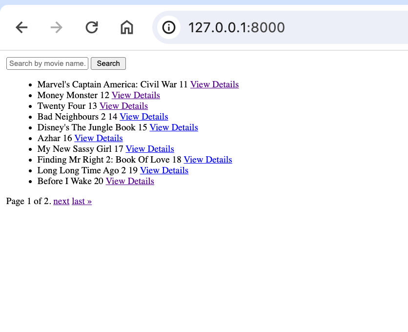
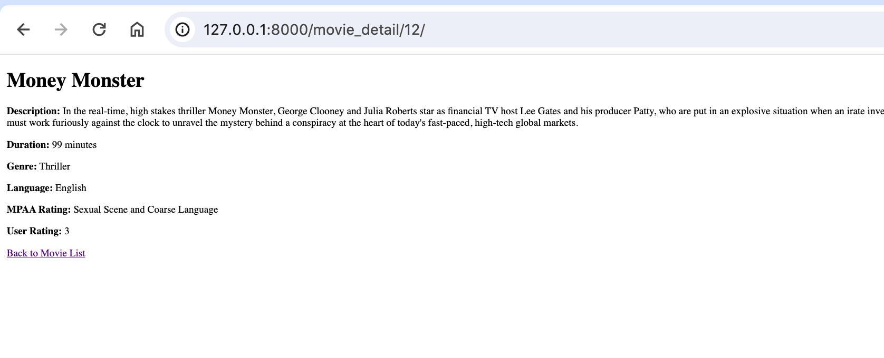
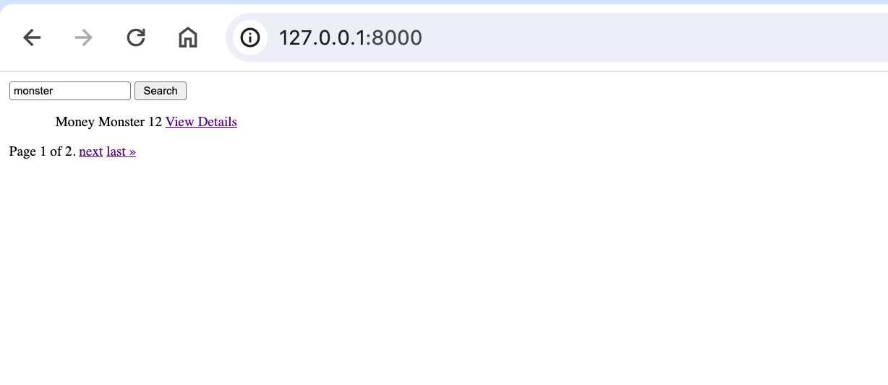

# django-test


## Clone

```bash
git clone : https://github.com/Adityapfm99/django-test
```

## activate a virtual environment
```bash
source venv/bin/activate
```

## Migrate 
```bash
 python manage.py migrate
```

## Run 
```bash
 python manage.py runserver
```

## Screen recording 
```bash
 https://drive.google.com/file/d/1kgqMyMMBxedNhgVVfaSO_5eYm7IBmvah/view?usp=sharing
```


## Movie List



## Movie Detail



## Search Bar

